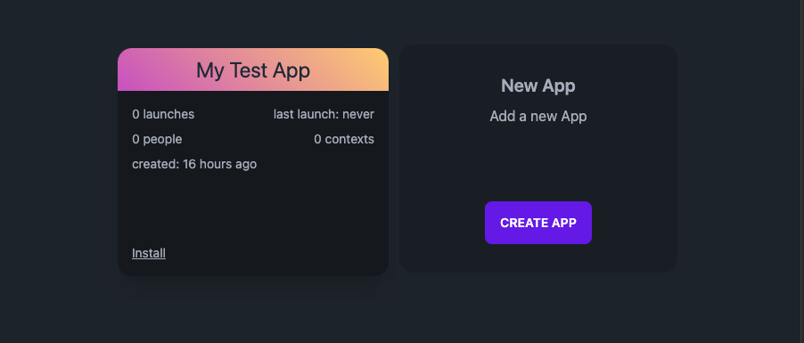
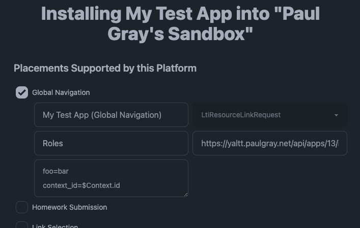

# Installing

Yaltt supports being installed into an LTI platform via Dynamic Registration. You can copy the registration URL here:

```
https://yaltt.paulgray.net/dynamic-registration
```

and paste it into any LTI platform that supports Dynamic Registration.

This which will launch you into your personal app list, where you can choose an app to install, or create one on the fly (If you have not created an app yet, it will simply say "Add a new app").



If you want to directly launch into an existing app, you can use the url `https://yaltt.paulgray.net/apps/{app_id}/dynamic-registration` (which you can find by going to the app and clicking on "Dynamic Registration.")

After choosing an app, Yaltt will request the openid-configuration from the platform in the background, and present configuration options that the tool provides. Any placements supported by the platform _and_ supported by Yaltt will be visible to be enabled.



Any services (also referred to as "scopes") offered by the platform will be available to request permission to access.


When you are happy with your configuration, click the "install" button at the end of the form to send back your selections to the platform.
