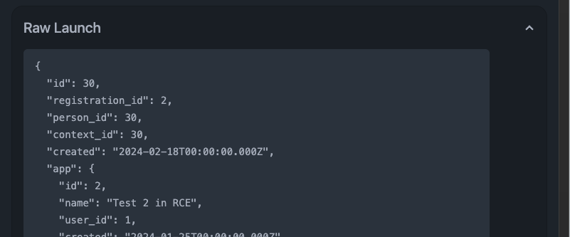
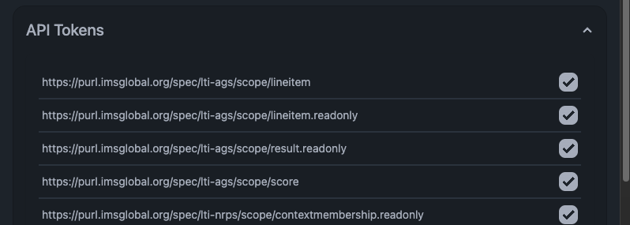
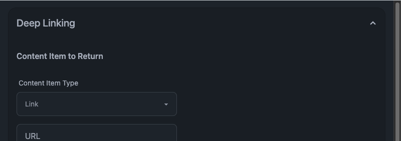

# Launching

Once registered, you can launch Yaltt from any of the placements you configured in the "Installation" phase. Yaltt stores every launch in its database, and previous launches can be accessed by viewing an app's registration.

When viewing a launch, Yaltt will show a few collapsible sections with details about the launch.

#### Raw Launch

The "Raw Launch" section will show the parsed `id_token` of the launch request from the platform. This will contain information about who made the launch, what context they launched from, and many other things.

#### API Tokens

The "API Tokens" section allows you to fetch an API token to be used to access any services the tool is permitted to use. It also will include sample `curl` commands pre-formatted with the API token for any services advertised in the launch (including the Line Items, Line Item, Names and Roles services).

#### Deep Linking

The "Deep Linking" view is available when the platform launches a message with `message_type` of `LtiDeepLinkingRequest`. In this panel, you can enter fields of a Content Item to be sent back to the platform. This mimics a flow where a teacher would launch into a tool and choose a piece of content to embed in the platform.
