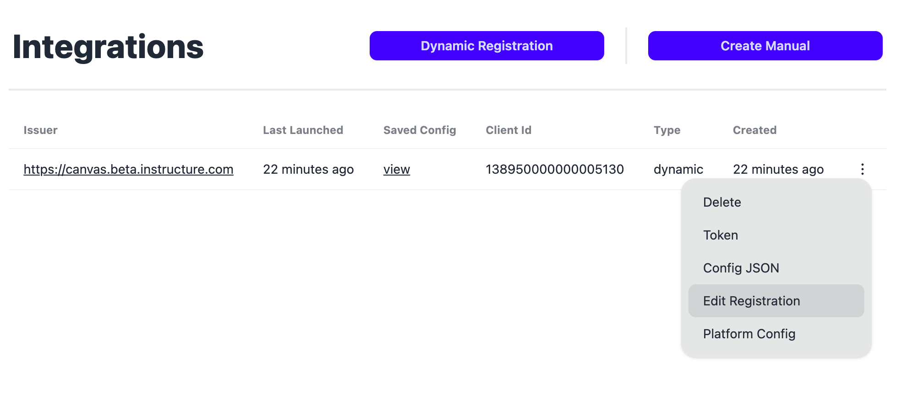
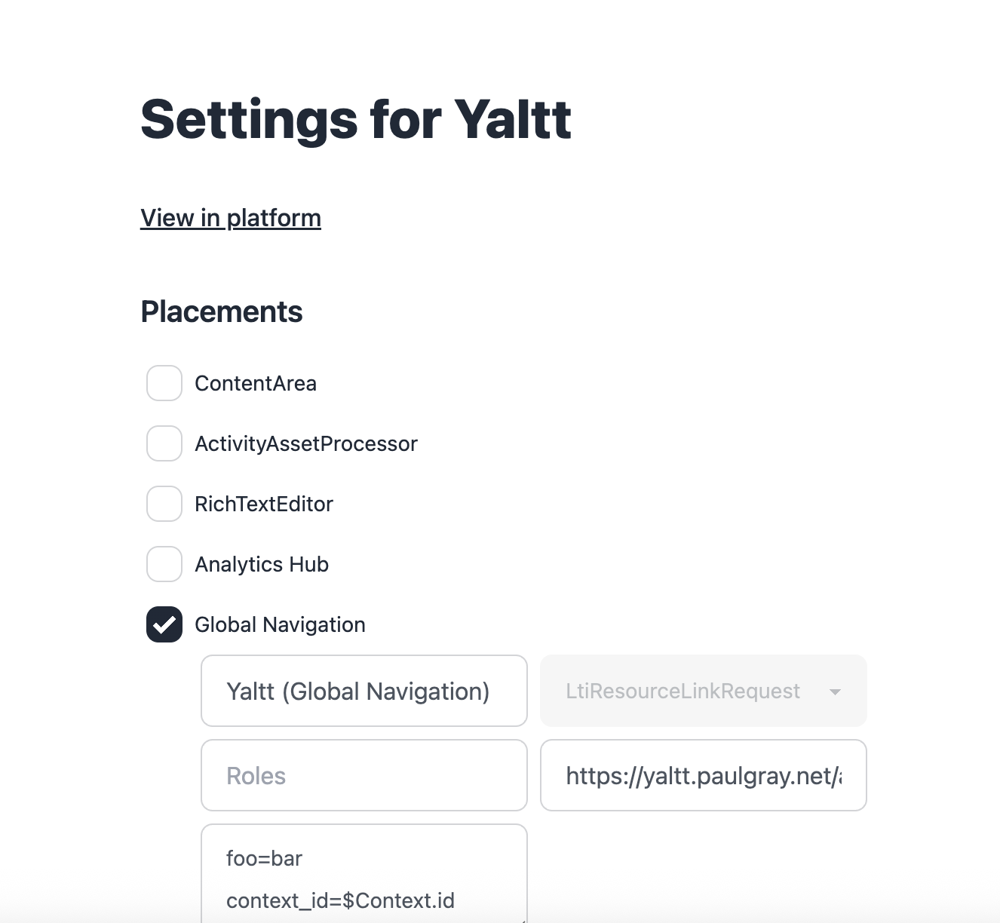

# Updating

After you've installed an App into a Platform, if the platform supports it, you may send Registration update requests.

Find the app you want to update, and click "Details." Once on the app's page, find the "integration" you used to install (An "integration" is a mapping from your app to a platform. Your app can be installed to as many platforms as you'd like), click on the actions menu to the right, and select "Edit Registration."

The form on this page will request the current state of the registration, and pre-fill the form for you. Make any changes and click "Update." This will send a PUT request to the platform with your new configuration.

After updating, depending on the platform, an administrator may need to approve the sent updates before they're applied.
